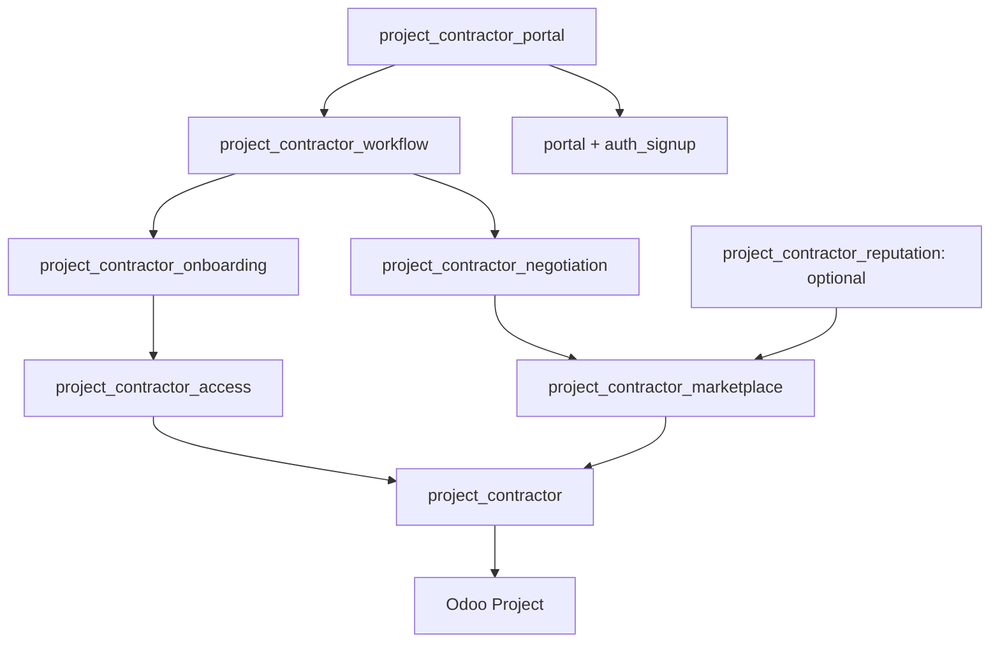

# Contractor workflow audit — 2026-09-18

## Scope and evidence

This is a repository-based planning audit, not a database verification report.
Read `AGENTS.md`, `CLAUDE.md`, all six `.claude/commands/opsx` workflows and their
six skill counterparts, `openspec/config.yaml`, all six main specs, the complete
archived foundation change, and the original marketplace proposal/design/tasks
and ten deltas. Inspected all addon Python models/tests, XML views, manifest,
README, git status/history and relevant local Odoo 19 security/ORM source.

Starting HEAD: `ae74aa1` (icon), preceded by foundation implementation commit
`702d9a6`. At the start, only `AGENTS.md` and `CLAUDE.md` were untracked;
`AGENTS.md` is unchanged. Neither file has been staged. No application code,
database, production service or git commit/push was changed by this audit.
No OpenSpec init/update migration, spec sync or archive was run by this agent.
During final checks, concurrent changes appeared in all twelve `.claude/`
workflow files and a new `.agents/skills/` tree. They were inspected read-only
and left untouched; their author/action is not established by this audit.

The foundation has 57 test methods across seven test modules. Tests are evidence
of intended coverage, not evidence of a passing run. The archived tasks claim
completion, including disposable install/uninstall/final tests; no durable test
log or explicit uninstall result was found in the archived notes. This audit
ran no Odoo tests because addon installation/upgrades and database changes were
not authorized. UI tests can be skipped when browser prerequisites are missing.

## Implemented baseline

| Main capability | Source and tests | Assessment |
| --- | --- | --- |
| `contractor-contact-classification` | `models/res_partner.py`, partner view, `test_contact_classification.py` | Implemented structurally: individual/company flag, commercial-entity eligibility, no account creation; tests cover historical preservation. Runtime not rerun. |
| `contractor-task-assignment` | `models/project_task.py`, task views, `test_task_assignment.py` | Implemented structurally: one eligible company-compatible contractor, separate assignees/customer, tracking without subscription, copy=False with duplication/template/recurrence tests. Runtime not rerun. |
| `contractor-project-participation` | `models/project_project.py`, project views, `test_project_participation.py` | Implemented with consistency gaps: computed/searchable participation exists; navigation does not use the same complete exclusion domain; same-transaction refresh is not proven. |
| `contractor-work-history` | `models/res_partner.py`, `test_work_history.py` | Implemented with consistency gaps: scoped counts/actions and company roll-up exist; raw One2many omits child-company work/template filtering; mutation tests manually invalidate caches. |
| `contractor-access-control` | no addon security objects; field groups/native task portal allowlist; `test_access_control.py` | Foundation's no-implicit-grant behavior is structurally present and explicitly tested, including portal RPC. This is not restricted internal-user isolation. |
| `contractor-addon-distribution` | manifest, inherited views, LGPL-3 LICENSE, `test_distribution.py`, README | Minimal Project-only dependency and packaging are present. Fresh install/uninstall/browser results cannot be independently certified from repository state. |

All six archived foundation requirement bodies exactly match the current main
spec bodies. This is intentional archive/current-baseline duplication, not a
reason to delete either. Leave main specs and archived artifacts unchanged;
remaining behavior belongs in open deltas.

Specific maintenance findings:

- `contractor_task_ids` is a plain inverse One2many while the spec promises
  company roll-up and excludes archived/template work. Actions/counts use a
  different domain. Direct relation reads therefore do not express the same
  contract.
- Project navigation omits `has_project_template` and explicit active exclusion
  used by `_get_contractor_work_domain` in the count/search computations.
- History/participation computes declare only context dependencies, not task
  dependencies. Existing mutation tests call `env.invalidate_all()`, masking
  whether repeated reads within one transaction update. Treat this as a
  source-based risk to reproduce, not a runtime failure claimed by this audit.
- Project-history aggregation must also verify project readability, not assume
  readable tasks authorize their related project's identity.

These are captured in `fix-contractor-history-consistency`, with no retroactive
changes to the archive's checked boxes.

## Original open change and reconciliation

`add-project-contractor-marketplace` was the sole open change: **0/45 tasks**,
all planning artifacts present, no `project_contractor_marketplace` addon or
marketplace implementation in the repository. OpenSpec's original `in-progress`
label did not mean code was partially implemented. There were no partially
implemented open changes and no fully implemented open archive candidates.

The archived foundation remains historical evidence of implementation, with the
limitations above. It is already archived and is not a new archive candidate.
**Nothing was archived, and no implementation task was marked complete.**

Reconciled stale or contradictory planning:

| Original issue | Resolution |
| --- | --- |
| Marketplace proposal said no archived specs existed and treated foundation archival as future | Corrected to the six main specs and existing archived foundation. |
| No complete frontend; presentation described as deployment-owned/outside repo | Explicit reusable portal delivery change and top-level install target. |
| Blanket ban on any messaging or uploads, and only post-assignment messaging as an extension | Preserve closed core audit records; plan private pre-authorization conversations and explicit document audiences in their own change. |
| Self-activated profile could be confused with approved contractor account | Keep public self-publication distinct; separate admin-only restricted internal approval and customer work authorization. |
| Assignment did not create scoped Project access | Explicit atomic authorization/workspace integration; standalone core assignment is documented as commercial only. |
| Multi-company rules listed as a non-goal | Company scope is now an explicit core and work-access requirement. |
| Generic manager typo writes versus uniform job edit lock | Manager non-protected edits must obey the same pending-proposal/lifecycle locks. |
| Internal-only chatter could expose notes to an internal contractor | Notes are manager-only; restricted internal participants receive participant projections only. |
| Direct dependency exclusion incorrectly implied no transitive `rating` | Clarified Project already brings rating transitively. |
| Location/license left as implementation blockers | Propose sibling addons here under the existing LGPL-3 license, subject to plan review; no files for those addons were created. |
| Reviews/reputation bundled with the required commercial/work workflow | Moved the two unimplemented delta specs to optional `add-marketplace-reviews-reputation`, with their own design/tasks. Existing policies retained and protected API/audit obligations made explicit. |

The marketplace proposal, design and task sequence were rewritten for this
reconciled scope; its eight remaining capabilities keep detailed scenarios.
The original committed plan is available in git history. The moved review and
reputation specs are not deleted product scope or completed work.

## Remaining change boundaries and dependencies

All eight changes have proposal, specs, design and tasks. All implementation
tasks remain unchecked. Each can be verified at its stated dependency boundary;
only the final portal change verifies the whole product through shipped pages.

| Change | Planned behavior | Prerequisites | Tasks |
| --- | --- | --- | --- |
| `restrict-contractor-internal-access` | Default-deny internal access ceiling, exact grants, compatibility checks, revocation | Existing foundation | 12 |
| `fix-contractor-history-consistency` | Consistent history relation/count/navigation and refresh regressions | Existing foundation; independent maintenance | 7 |
| `add-contractor-onboarding` | Private applications, administrator review, same-identity approval/demotion | Verified internal isolation | 8 |
| `add-project-contractor-marketplace` | Profiles, listings, offers, commercial acceptance/execution, audit/API | Existing foundation | 20 |
| `add-contract-negotiation` | Customer outreach, private messages/uploads, initial price, offer revisions | Marketplace core | 12 |
| `authorize-contract-workspaces` | Explicit customer consent, atomic grants, dedicated Project workspace, active work and revocation | Isolation + onboarding + marketplace + negotiation; history fix before integrated verification | 12 |
| `add-contractor-portal-workflow` | Complete reusable customer/contractor/admin navigation and pages | All required domain/security changes | 11 |
| `add-marketplace-reviews-reputation` | Immutable customer reviews and derived profile reputation | Marketplace core; optional follow-on | 6 |

Total: **88 pending implementation tasks**, not 88 completed specifications.
Suggested sequential apply order is the table order. Onboarding and marketplace
are independent once their prerequisites pass; optional reputation must not
block delivery of the required workflow.

Proposed package graph (names are planning decisions, not existing addons):



This preserves the foundation's existing distribution/security contract while
making the complete workflow deliverable inside this repository. One large
replacement of the foundation or deployment-specific frontend is unnecessary.

## Product coverage and security model

| Requested outcome | Planning owner |
| --- | --- |
| Portal registration/application, administrator internal approval | Onboarding + portal |
| Internal account without unrelated database access | Isolation, verified before onboarding |
| Ordinary portal customer creates/uploads opportunities | Marketplace + negotiation documents + portal; no contractor verification gate |
| Directory and approach one or more contractors | Marketplace profiles + private negotiations + portal |
| Initial proposed price and negotiation | Negotiation structured price/revision requirements |
| Frontend participant messaging | Separate negotiation/workspace channels, portal rendering |
| Contact does not grant protected workspace access | Negotiation no-grant scenarios + isolation + workspace requirements |
| Agreed terms and explicit customer work authorization | Revision-aware atomic acceptance/workspace operation |
| Authorized contracts in active work | Effective grants + active-contract search/count/navigation |
| Reusable backend/frontend installation | Sibling addon graph + portal clean-database acceptance tests |

Authorization is based on exact authenticated identity, explicit supported
model/operation policies and current per-resource grants. Customer-owned
opportunities and private negotiations are separate from protected execution
workspaces. Public directory/listing projections are deliberately publishable
content, not access to the underlying private contacts or customer workspace.
Company membership, task contractor classification, followers, invitations,
profile publication and internal approval never substitute for customer consent.

Odoo ACLs are additive and group record rules combine permissively, while global
restrictions intersect. The proposed ceiling therefore cannot be merely a
restrictive contractor group; native ORM reads/searches and elevated controller
paths must be covered. See [Odoo 19 security documentation](https://www.odoo.com/documentation/19.0/developer/reference/backend/security.html)
and the local source findings in the isolation design. Unknown model/route or
module combinations fail closed; no universal safety claim for arbitrary
third-party server code is made.

Proposed product decisions to review with the plan:

- Public profile self-publication remains separate from private account approval.
  Portal contractors can negotiate; protected work requires approved restricted
  internal status plus explicit customer authorization.
- The first implementation uses one winning contractor and one dedicated native
  Project workspace per opportunity; multiple contractors can be approached.
- “Accept terms and authorize work” is one explicit atomic customer decision,
  checked against the displayed offer revision. A message saying “accepted” has
  no authorization effect.
- Revocation/cancellation removes protected access; completed work is read-only
  only for still-approved, non-revoked participants. Administrative revocation
  returns workflow-managed accounts to portal without erasing customer history.
- Initial uploads accept safe PDF/text/JPEG/PNG content with a proposed 10 MiB
  limit; participant communication is in-platform, without outbound email in
  the initial delivery. These are concrete reviewable scope choices.

## Codex and OpenSpec integration

Installed CLI at the start: **OpenSpec 1.13.0**; at final verification:
**1.13.1**. Repository config remains `schema: spec-driven`; the resolved root
is this repository, not a store. Global profile changed concurrently from
`core` to `custom` with the same six workflows (propose/explore/apply/update/
sync/archive); delivery remains `both`. This agent changed no configuration.

The session's exposed skill catalog contains no native `$openspec-*` skills.
Initially the repository had no `.agents/skills` or `.codex/skills` layer. At
final inspection, `.agents/skills` contains six regular (not symlinked) generated
OpenSpec 1.13.1 SKILL.md files and a `.openspec-target` marker containing `codex`;
`.codex/` is absent. The twelve `.claude/` workflows were also refreshed to
1.13.1. These concurrent changes were not authored by this agent and were not
reverted. Native Codex discovery is now provisioned on disk, but activation in
this already-running session is unverified. Codex can still directly read
the canonical `.claude/` workflows and use the CLI, as this audit did. No integration change
is needed to plan or apply correctly; natural-language instructions can name
the change and `.claude/skills/openspec-apply-change/SKILL.md` explicitly.

Inspected installed CLI sources under
`@fission-ai/openspec/dist/core/`: `config.js`, `profiles.js`, `init.js`,
`command-surface.js`, `shared/skill-generation.js`, `shared-skill-target.js`, plus
`utils/command-references.js`. With these six selected workflows, Codex generation produces the following
full generated workflow files, now also observed on disk:

```text
.agents/skills/openspec-propose/SKILL.md
.agents/skills/openspec-explore/SKILL.md
.agents/skills/openspec-apply-change/SKILL.md
.agents/skills/openspec-update-change/SKILL.md
.agents/skills/openspec-sync-specs/SKILL.md
.agents/skills/openspec-archive-change/SKILL.md
.agents/skills/.openspec-target   # contains codex
```

Codex is a `skills-invocable` target: invocation references use `$openspec-*` and
no separate Codex slash-command files are generated. These are **full generated
workflow bodies**, not thin adapters delegating to `.claude/`. Keeping them
maintains another workflow copy even though the requirements still live
only under `openspec/`. These regular files conflict with this repository's no-duplication
preference unless explicitly accepted; they are not thin adapters. Do not run `openspec init --tools codex`
or a broad `openspec update` as a harmless discovery step: they write/refresh
managed files and can reconcile/remove legacy generated outputs. Existing
`.claude/` workflows could also be regenerated by a broad update. No such
command was issued by this agent; the cause of the concurrent refresh was not
verified.

To reconcile the newly observed duplication later, the smallest
non-duplicating native-discovery proposal is six directory symlinks, one per `.claude/skills/openspec-*` folder, from
`.agents/skills/`. That uses the existing SKILL.md frontmatter and contents as
the sole workflow source, not a generated second body. Codex documents support
for symlinked skill folders in its [skill discovery documentation](https://learn.chatgpt.com/docs/build-skills).
This is a Codex-supported discovery option, **not an OpenSpec-managed adapter
mode**. Do not point broad OpenSpec generation at those links: generation might
rewrite the canonical target. The existing Claude-style command references can
be followed by Codex through the equivalent CLI workflow; do not claim those
references become separate shell commands. A refresh/new session may be needed
to expose skills in a particular client. This agent created no symlink, wrapper, global skill, marker or `.agents/`
tree. Do not remove or replace the concurrent files without a separate explicit
instruction; the supported no-file-change option remains direct workflow use.

## Validation and limits

Executed after planning changes:

- `openspec validate --all --strict --no-interactive --json`: 14/14 passed
  (eight changes, six current specs), zero failures. One informational message
  notes an existing long requirement in `contractor-addon-distribution`; no
  error or warning requires changing the implemented baseline.
- `openspec validate --archived --strict --no-interactive --json`: 1/1 passed.
  This validates archived task completeness syntax, not implementation/runtime.
- `openspec doctor --json`: repository root healthy, no relationship issues.
- Per-change `openspec status --change <name> --json`: all eight have complete
  planning artifacts. This status does not mean application implementation.
- `git diff --check`: clean. Application files, main specs and archive unchanged.
  An additional scope assertion detected the concurrent `.claude/` changes; it
  was investigated and attributed as unowned changes above, not reverted. This
  is distinct from the passing OpenSpec validation results.

No Odoo install, upgrade, restart, database test, commit, push or archive was
performed. Runtime security and installability remain future verification gates.

## Next action

Review this plan, particularly internal-isolation scope and the proposed
packaging/authorization choices. The recommended first apply is
`restrict-contractor-internal-access`, because promotion must never precede the
verified boundary. After explicit approval, ask Codex:

> Apply `restrict-contractor-internal-access` using the existing
> `.claude/skills/openspec-apply-change/SKILL.md` workflow.

Claude's equivalent is `/opsx:apply restrict-contractor-internal-access`.
`openspec instructions apply --change restrict-contractor-internal-access --json`
is the CLI instruction lookup used by that workflow, not an implementation
command by itself. The audit stops before apply; archiving requires later
explicit approval after implementation and verification.
