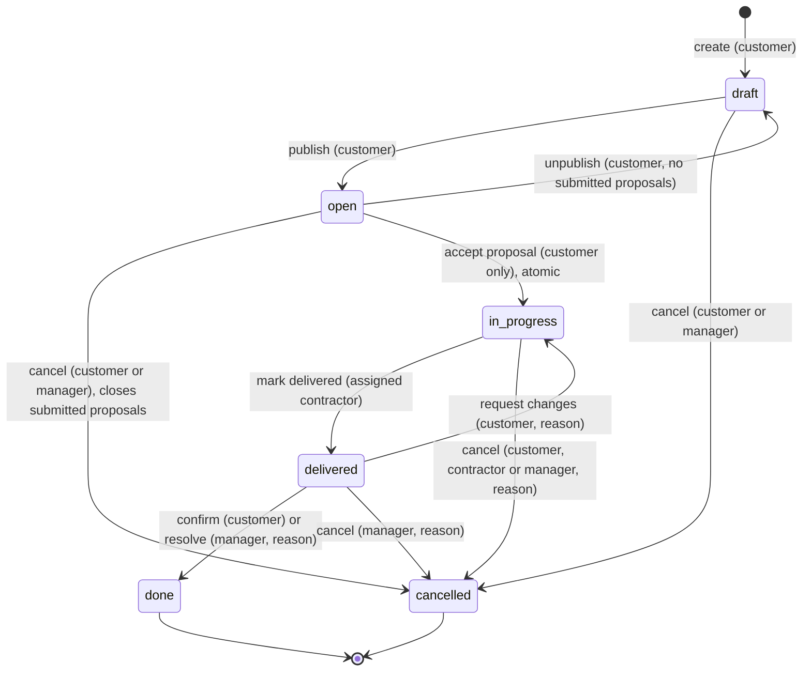
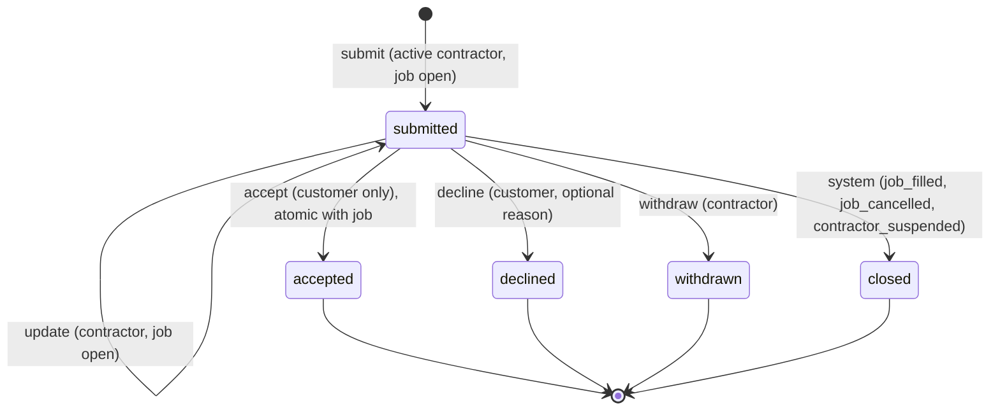
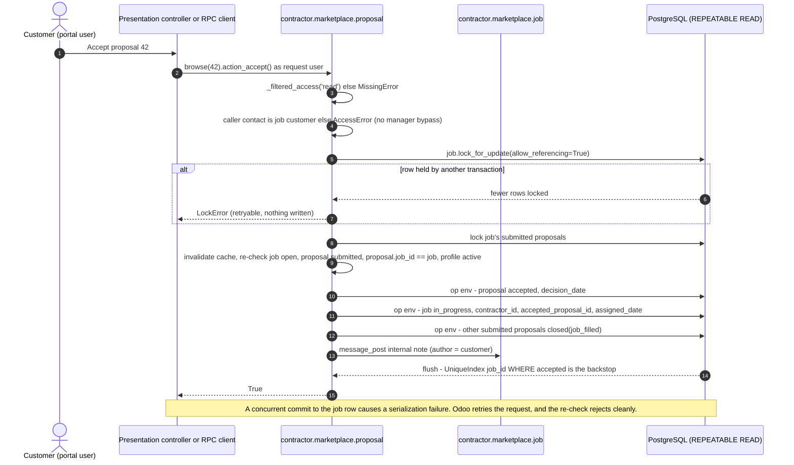
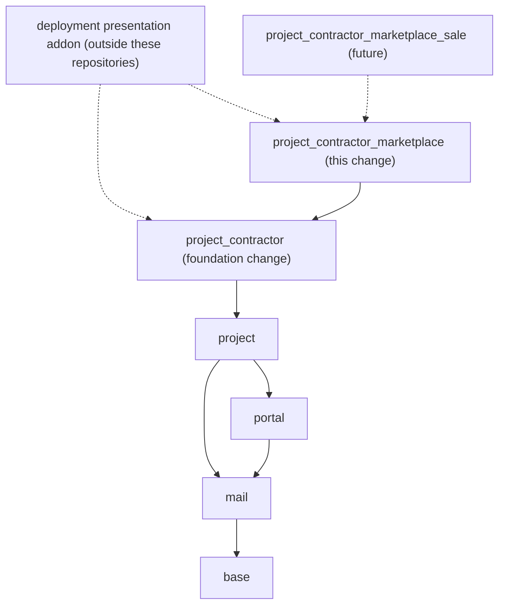

## Context

See proposal.md for motivation. Requirements live in `specs/*/spec.md`. This document explains how to meet them. It keeps the Odoo 19 research and security design done for the original marketplace plan, re-based on the `project_contractor` foundation.

### Starting point

- **Nothing is implemented.** The addon `project_contractor_marketplace` does not exist yet. Its location (sibling addon folder in the `project_contractor` repository, OCA-style, or its own wrapper repository) is decided in task 1.1.
- **Prerequisite:** the foundation change `add-project-contractor-foundation` is implemented. It provides:
  - `res.partner.is_contractor`, plus eligibility via the commercial entity;
  - `project.task.contractor_id`;
  - project participation and partner work history.

  It adds no groups, rules or portal exposure.
- **Change history:** this change was renamed from `add-contractor-marketplace-domain` (originally for a deployment-specific addon). Odoo-consulting-specific content (Odoo-version catalog, work types) and deployment references were removed. Security findings and policy decisions were kept.

### Verified Odoo 19 facts that drive decisions

| Fact | Source |
| --- | --- |
| `/web/dataset/call_kw` and `/call_button` are `auth="user"`, so **any portal user can call any public model method** over RPC. | `web/controllers/dataset.py:28-34` |
| Methods prefixed `_` or decorated `@api.private` cannot be called over RPC. | `orm/decorators.py:328-341`, `service/model.py:50-68` |
| `lock_for_update(allow_referencing=)` runs `SELECT … FOR [NO KEY] UPDATE SKIP LOCKED` and raises `LockError` (a `UserError`) if any row isn't locked. | `orm/models.py:5564-5590`, `exceptions.py:109` |
| Cursors use REPEATABLE READ. RPC and HTTP requests are retried on `SERIALIZATION_FAILURE`, `LOCK_NOT_AVAILABLE` and `DEADLOCK_DETECTED`. | `sql_db.py:373`, `service/model.py:28,160` |
| `models.Constraint`, `models.Index`, and `models.UniqueIndex(definition, message)` are supported, including partial `… WHERE …` definitions. | `orm/table_objects.py:79-200` |
| A Many2one `convert_to_read` evaluates `display_name` **as superuser**, so any readable many2one leaks the target's name. | `orm/fields_relational.py:366-376` |
| The portal/public `res.partner` rule is `id child_of user.commercial_partner_id`: portal users cannot read other contacts. | `base/security/base_security.xml:23-26` |
| `sudo()` only flips `su` and keeps `uid`, so tracking and message authorship stay with the real user. | `orm/models.py:5975-5978` |
| An attachment with `res_model`/`res_id` is readable **iff the document is readable**; the message's internal flag is not considered. | `base/models/ir_attachment.py:514-575` |
| The `mail.mt_note` subtype is `internal=True`. `message_follower_ids`, `message_partner_ids` and activity fields are `groups='base.group_user'`. `_mail_post_access` defaults to `'write'`. | `mail_message_subtype_data.xml:10-16`, `mail_thread.py:131,141-147` |
| `ir.rule._make_access_error` shows records' `display_name` only to internal users in `base.group_no_one`. | `base/models/ir_rule.py:208-253` |
| Group rules are OR-ed together and global rules are AND-ed. | `base/models/ir_rule.py:84-106` |
| Groups are organised under `res.groups.privilege` in 19. | `project/security/project_security.xml:4-22` |
| `rating.rating` is generic (`res_model`/`res_id`, token, `rated_partner_id` as the "operator"). It has portal and public ACL `0` and no per-document uniqueness. | `rating/models/rating.py:27-54` |
| Redefining the `create_uid` magic field on a model is an established pattern; field attributes are merged at setup. | `website_forum/models/forum_post.py:50`, `orm/fields.py:491` |
| Task stages are user-editable kanban columns. Portal task access is per project (`privacy_visibility`, collaborators) plus a field allowlist (`PROJECT_TASK_READABLE_FIELDS`). | `project/models/project_task.py:21-81,161-164`, `project_project.py:119-154` |

## Goals / Non-Goals

**Goals:**
- Every guarantee in the specs holds at the ORM/RPC boundary for a caller acting as the request user, whatever the controller.
- Deny by default: non-managers cannot mutate records generically, operations accept allowlisted input, and protected fields can't be written generically by anyone.
- Reuse the foundation's contractor identity. Use Odoo-native mechanisms (ACL, `ir.rule`, field `groups`, `mail.thread`, `ir.sequence`, SQL constraints and unique indexes, stored computes, ORM row locks).
- Keep the model minimal but ready for hourly and fixed pricing, invoicing, commissions, milestones and disputes later.
- Each implementation phase is independently installable and testable.

**Non-Goals:**
- Participant messaging, attachments, portfolios and profile images (extension points).
- Invite-only jobs, job templates, saved searches, email notification templates, ranking or weighted ratings, multi-company rules.
- Payments, escrow, commissions and payouts. Hosted-environment access. Domain-specific catalogs (for example software versions).
- Creating or synchronizing project tasks in v1.

## Terminology

| Term | Meaning |
| --- | --- |
| Job | A marketplace listing of work (`contractor.marketplace.job`). Not a legal contract. |
| Customer | The individual contact that owns a job (`customer_partner_id`). |
| Contractor | A contact with a marketplace profile. It is classified as a contractor by the foundation once the profile is active. |
| Assigned contractor | The profile set on a job by acceptance (`contractor_id`). Its contact is `contractor_partner_id`. |
| Participant | For a job: its customer and assigned contractor. For a proposal: its contractor and the job's customer. |
| Marketplace manager | Member of `project_contractor_marketplace.group_marketplace_manager`, an internal group. Settings administrators get it through an implied group. |
| Domain operation | A public, RPC-callable model method that performs one business action with its own authorization. |
| Protected field | A field that generic `create`/`write` rejects for every caller. Only domain operations change it. |

## Decisions

### D1. Own marketplace models; `project.task` is not the listing or the lifecycle

| Option | Assessment |
| --- | --- |
| **Own models (chosen)** | Explicit state machines and invariants, marketplace-specific record rules (public open jobs, private proposals), no coupling to editable stages. |
| `project.task` as the job | Stages are editable kanban columns, so dragging a card bypasses lifecycle invariants. Portal visibility is per project plus a field allowlist, which can't express "anyone may read an open job, proposals are private". There's no proposal concept, and public listing would need tasks from unrelated customers in shared projects. |
| `sale.order` as job or proposal | Inverted semantics (portal user buys from portal user). Pulls in `sale`, `account` and pricelists. |
| Hand-off to `project.task` after acceptance | A good **later** integration (D18). It uses the foundation's `contractor_id`; the job stays the marketplace source of truth. |

### D2. Model naming

| Model | Purpose | Replaces (earlier draft) |
| --- | --- | --- |
| `contractor.marketplace.profile` | 1:1 public-facing profile of a contractor contact | contractor profile |
| `contractor.marketplace.job` | Marketplace job | contract job |
| `contractor.marketplace.proposal` | Proposal or offer | proposal |
| `contractor.marketplace.review` | Customer review of a contractor | review |
| `contractor.marketplace.skill` | Generic skill and specialty tags | skill catalog |
| `contractor.marketplace.guard.mixin` | Abstract protected-field guard | guard mixin |
| `contractor.marketplace.reason.wizard` | Transient reason prompt for backend buttons | reason wizard |
| *(none)* | Odoo-version catalog **dropped**. Deployments use skills. | Odoo-version catalog |

A `contractor.marketplace.*` namespace keeps marketplace models clearly separate from the foundation (which adds fields, not models). It avoids any "contract" reading, and doesn't clash with core or OCA namespaces. *Rejected:* `project.contractor.*` (would crowd a namespace the foundation may use later) and `contract.*` (legal-contract connotation; OCA `contract` collision).

### D3. Contractor profile on top of the foundation's contact identity

- `partner_id = Many2one('res.partner', required=True, ondelete='restrict', index=True, groups=MANAGER)`, backed by `models.UniqueIndex('(partner_id)')`.
- Publishable fields only: `public_name`, `headline` (≤120), `bio` (Text ≤5000), `skill_ids`, `hourly_rate` (Monetary, optional), `currency_id` (`res.currency`, active, default company currency), `availability`, `country_id` (optional, entered by the contractor).
- Status and publication: `state` (`draft`/`active`/`suspended`), `is_published`, `is_verified`, `suspension_reason` (manager-only), `suspended_date`.
- Reputation (D16): `completed_job_count`, `review_count`, `rating_avg`, `avg_completion_days`. Helper: `is_mine`.
- **Foundation link.** `action_activate` writes `partner_id.is_contractor = True` in the operation environment (D6) when needed. Suspension and unpublishing never clear it (spec *Activation classifies the contact as a contractor*). The foundation flag grants nothing by itself, so self-service activation is safe.
- **Self-service lifecycle (confirmed).** Activation and publication need no manager step, and `is_verified` is a badge only. *Extension:* a `pending_review` state or publish-approval flag, gated by configuration.
- *Why not fields on `res.partner`:* portal and public users can read only their own commercial contact. Public profile fields there would force loosening that rule and expose email, phone and address.

### D4. Roles come from records; one security group

- **`project_contractor_marketplace.group_marketplace_manager`** ("Marketplace Manager"):
  - under `res.groups.privilege` "Contractor Marketplace" (category `base.module_category_services`);
  - `implied_ids = base.group_user`;
  - `base.group_system` gets `(4, group_marketplace_manager)`.
- No contractor or customer group: eligibility comes from records (an active profile, `customer_partner_id`, `contractor_id`).
- Internal non-managers are treated exactly like portal users; rules are duplicated for `base.group_portal` and `base.group_user`.

### D5. Deny-by-default mutation surface (ACL)

| Model | public | portal | user (internal) | manager |
| --- | --- | --- | --- | --- |
| profile, job, review | R | R | R | R W C U\* |
| proposal | – (no line) | R | R | R W C U\* |
| skill | R | R | R | R W C U |
| reason wizard | – | – | – | R W C U |

\*Deletion is further limited by `@api.ondelete` guards. Proposals and reviews always refuse deletion.

Each operation:
1. resolves the target under the caller's access;
2. authorizes the actor (exact `user.partner_id` match, no group bypass for customer decisions);
3. validates the allowlist;
4. locks rows;
5. re-checks preconditions;
6. writes through the operation environment;
7. posts audit notes.

### D6. Protected-field guard (abstract mixin)

```python
_OP_CONTEXT_KEY = 'contractor_marketplace_domain_op'
_protected_fields = frozenset()          # set per model

@api.model_create_multi
def create(self, vals_list):
    self._check_protected_fields(set().union(*vals_list))
    return super().create(vals_list)

def write(self, vals):
    self._check_protected_fields(vals.keys())
    return super().write(vals)

def _check_protected_fields(self, keys):
    if keys & self._protected_fields and not (self.env.su and self.env.context.get(_OP_CONTEXT_KEY)):
        raise AccessError(...)

def _op_env(self):                        # private: not RPC-callable
    return self.sudo().with_context(**{_OP_CONTEXT_KEY: True, 'mail_create_nosubscribe': True})
```

- **Why both `su` and the context key.** RPC can set context keys but never obtains `su`. Requiring the key as well also stops a stray `sudo().write(request_vals)` in any downstream module.
- Values filled from defaults are not in `vals`. Stored computes (reputation) are flushed by the ORM without calling `write()`, so recomputation is unaffected.
- The foundation's `res.partner.is_contractor` is **not** protected. It is an ordinary internal classification; the marketplace sets it only additively (D3).

### D7. Record rules (read)

Rules are `perm_read=True` only. `P = user.partner_id.id`, **always the exact contact** (confirmed individual ownership).

| Rule | Groups | Domain |
| --- | --- | --- |
| job_public | `base.group_public` | `[('state','=','open'), ('visibility','=','public')]` |
| job_participant | portal, user | `['\|','\|', '&', ('state','=','open'), ('visibility','in',['public','portal']), ('customer_partner_id','=',P), ('contractor_id.partner_id','=',P)]` |
| proposal_participant | portal, user | `['\|', ('contractor_id.partner_id','=',P), ('job_id.customer_partner_id','=',P)]` |
| profile_public | public | `[('state','=','active'), ('is_published','=',True)]` |
| profile_participant | portal, user | `['\|', '&', ('state','=','active'), ('is_published','=',True), ('partner_id','=',P)]` |
| review_public | public | `[('is_hidden','=',False), ('contractor_id.state','=','active'), ('contractor_id.is_published','=',True)]` |
| review_participant | portal, user | the public domain OR `('reviewer_partner_id','=',P)` OR `('contractor_id.partner_id','=',P)` |
| *_manager | manager | `[(1,'=',1)]` |

No proposal rule or ACL line exists for the public group. Rules evaluate as superuser, so manager-only field `groups` don't affect rule domains. This is proven by a Phase 1 test before other work relies on it.

### D8. Field-level privacy and display names

- **Manager-only `groups`:**
  - `profile.partner_id`, `profile.suspension_reason`;
  - `job.customer_partner_id`, `job.proposal_ids`, `job.cancelled_by_role`;
  - `review.job_id`, `review.reviewer_partner_id`, `review.hidden_reason`;
  - redefined `create_uid` and `write_uid` on the four models (operations run as the real uid, and the Many2one display name is read as superuser).
- **Per-caller job helpers** (computed with `compute_sudo` plus an explicit participant check): `is_customer` and `is_assigned_contractor` (with sudo-subquery `_search`), `my_proposal_id`, `proposal_count` (customer and manager only), `customer_display_name` (participants only). Profiles get `is_mine`.
- **Neutral display names:** job `[JOB-00012] <title>`, proposal `PROP-00042`, review `REV-00007`, profile `public_name`.
- `contractor_partner_id` on the job is a stored related field to the assigned profile's contact, manager-only. It is the join point for the task hand-off (D18).

### D9. Chatter and audit

- `mail.thread` on the four models; `mail.activity.mixin` on the job only.
- `_mail_post_access='write'`, so portal and public users can't post.
- Tracking uses the internal note subtype.
- `mail_create_nosubscribe`: participants are never auto-followers.
- Reasons are stored on fields **and** posted as internal notes. Authorship stays with the real user.

### D10. Attachments refused on marketplace models (v1)

An `ir.attachment` `create`/`write` guard raises `ValidationError` for `res_model` in the four marketplace models, in every state. This closes the verified exposure that attachments are readable by anyone who can read the document. It isn't relaxed before a dedicated attachments spec exists.

### D11. Job model and lifecycle

**Fields**
- Editable by the customer through operations: `name` (≤120), `description`, `skill_ids`, `pricing_type` (`fixed`/`hourly`), `budget_min`/`budget_max` (Monetary ≥0, min ≤ max), `currency_id` (`res.currency`, active, default company currency, never restricted to it), `duration_estimate`, `visibility` (default `portal`; `public` only by explicit choice; no transition changes it).
- Protected: `reference`, `customer_partner_id`, `company_id`, `state`, `contractor_id`, `contractor_partner_id`, `accepted_proposal_id`, `published_date`, `assigned_date`, `delivered_date`, `done_date`, `cancelled_date`, `cancel_reason`, `cancelled_by_role`, `delivery_note`, `change_request_note`, `revision_count`.



| Transition | Actor | Preconditions | Side effects | Timestamp |
| --- | --- | --- | --- | --- |
| create | authenticated non-public user | allowlisted input | reference; customer = caller's contact | `create_date` |
| publish | customer | draft; title, description, pricing type | — | `published_date` |
| unpublish | customer | open; no `submitted` proposals | — | — |
| update details | customer | draft, or open with no `submitted` proposals; uniform lock | tracked | — |
| cancel (pre) | customer / manager (reason) | draft or open | `submitted` → `closed(job_cancelled)` | `cancelled_date` |
| accept | customer only | D13 | D13 | `assigned_date` |
| mark delivered | assigned contractor | in_progress | `delivery_note` | `delivered_date` |
| request changes | customer | delivered; reason | `revision_count += 1` | — |
| confirm | customer | delivered | reputation recompute | `done_date` |
| resolve done | manager | delivered; reason | audit note | `done_date` |
| cancel (post) | customer / contractor from in_progress; manager from in_progress or delivered | reason | accepted proposal kept | `cancelled_date` |

`done` and `cancelled` are terminal, and nothing reopens a job.

### D12. Proposal model and lifecycle

- **Contractor-editable while `submitted`:** `message` (≤5000), `pricing_type`, `amount` (>0), `estimated_days` (≥1).
- **Protected:** `reference`, `job_id`, `contractor_id`, `currency_id` (related to the job, stored), `state`, `close_reason`, `decline_reason`, `submitted_date`, `decision_date`.
- **Indexes and constraints:**
  - `UniqueIndex('(job_id) WHERE state = \'accepted\'')`;
  - `UniqueIndex('(job_id, contractor_id) WHERE state IN (\'submitted\', \'accepted\')')`;
  - CHECKs on `amount` and `estimated_days`.
- **Resubmission (confirmed):** any `declined` proposal by the same contractor on the job blocks new submissions, even after republishing. A `withdrawn` proposal never blocks, but every new submission re-runs the full eligibility check under the job lock.



### D13. Atomic acceptance and concurrency



The guarantees are layered:
1. A job row lock taken by every job-state-dependent operation.
2. Re-check after the lock.
3. REPEATABLE READ retry.
4. Partial unique indexes as the last defense.
5. Lock order is always job, then proposals.

*Trade-off:* `SKIP LOCKED` fails fast with `LockError`; a waiting parameterized `FOR NO KEY UPDATE` is the fallback if collisions prove common.

### D14. Completion, confirmed by the customer and resolved by managers

- **No automatic completion:** no `ir.cron`, automated action, or elapsed-time logic.
- **No participant cancellation after delivery:** `action_cancel` accepts `delivered` only from managers.
- **Stuck deliveries** are handled only by `action_resolve_done(reason)` and `action_cancel(reason)`.
- Other exceptional workflows need their own explicit operations and specs.

### D15. Reviews: own model, not `rating.rating`

- **Protected fields:** `reference`, `job_id` (unique, manager-only), `reviewer_partner_id` (manager-only), `contractor_id`, `rating`, `comment` (≤2000), `submitted_date`, `is_hidden`, `hidden_reason`.
- **Constraints:** `UniqueIndex('(job_id)')` and `CHECK(rating BETWEEN 1 AND 5)`.
- **Moderation toggles visibility only.** `rating`, `comment` and `submitted_date` are never altered, and unhiding restores the original exactly.
- **Customer-to-contractor only, no deadline check.**
- *Why not `rating.rating`:* generic keys with token submission, internal-operator semantics, portal ACL `0`, no per-job uniqueness.

### D16. Reputation: stored computed fields on the profile

`assigned_job_ids` and `review_ids` are manager-only One2manys. `@api.depends` on job state and dates and on review rating and hidden state feeds `completed_job_count`, `review_count`, `rating_avg` (2 decimals) and `avg_completion_days` (1 decimal), all stored, readonly and protected. No cron.

This is **separate from** the foundation's partner work history, which counts project tasks, not marketplace jobs.

### D17. Commercial extension shape (no payment logic)

- `pricing_type`, `amount`, `estimated_days` and `currency_id` on the proposal, plus `company_id` and `currency_id` on the job.
- `accepted_proposal_id` is the agreement anchor for future milestones, escrow, invoices and disputes.
- **Multi-currency capable:** every Monetary field is bound to a `res.currency` Many2one, and the company currency is a default only. No conversion happens in v1, and reputation has no monetary aggregates.

### D18. Integration with the `project_contractor` foundation

- **v1 uses:** the contractor classification (D3 activation), and the contact identity for customers and contractors.
- **Extension, not v1: task hand-off.** A future explicit manager operation (for example `action_create_project_task(project)`) would create or link a `project.task` for an `in_progress` job with `contractor_id = job.contractor_partner_id`. Execution tracking then flows into the foundation's project participation and work history. The job lifecycle would remain authoritative; task stages never drive job transitions (spec *Marketplace jobs are the marketplace's source of truth*).
- The foundation never depends on, or knows about, the marketplace.

### D19. Sales and accounting integration

Later bridge addons (for example `project_contractor_marketplace_sale`) handle quotations, invoices, commissions and payouts keyed on the job and its accepted proposal. Not in this change.

### D20. Addon dependencies



- `depends` is exactly `["project_contractor"]`. `project`, `mail` and `portal` (including `base.group_portal`, which lives in `base`) are transitive. The addon uses no `portal.mixin`, whose `access_url` would encode frontend routes and whose tokens bypass rules.
- No controllers, templates or assets. Presentation addons depend on this addon, never the reverse. No glue addon.

### D21. Domain API

| Model | Operation | Kind | Actor | Input allowlist |
| --- | --- | --- | --- | --- |
| profile | `create_my_profile(values)` | `@api.model` | authenticated | `public_name, headline, bio, skill_ids, hourly_rate, currency_id, availability, country_id` |
| profile | `update_profile(values)` | record | owner | same |
| profile | `action_activate()` / `action_publish()` / `action_unpublish()` | record | owner (unpublish: also manager) | — |
| profile | `action_suspend(reason)` / `action_reinstate(reason=None)` / `action_set_verified(verified)` | record | manager | — |
| job | `create_job(values)` | `@api.model` | authenticated | `name, description, skill_ids, pricing_type, budget_min, budget_max, currency_id, duration_estimate, visibility` |
| job | `update_job(values)` | record | customer | same |
| job | `action_publish()` / `action_unpublish()` | record | customer | — |
| job | `action_cancel(reason=None)` | record | customer; assigned contractor (in_progress); manager | — |
| job | `action_mark_delivered(note=None)` | record | assigned contractor | — |
| job | `action_request_changes(reason)` / `action_confirm_completion()` | record | customer | — |
| job | `action_resolve_done(reason)` | record | manager | — |
| proposal | `submit_proposal(job_id, values)` | `@api.model` | active contractor | `message, pricing_type, amount, estimated_days` |
| proposal | `update_proposal(values)` / `action_withdraw()` | record | proposal owner | same / — |
| proposal | `action_decline(reason=None)` / `action_accept()` | record | customer only (no group bypass) | — |
| review | `submit_review(job_id, values)` | `@api.model` | customer of done job | `rating, comment` |
| review | `action_hide(reason)` / `action_unhide(reason=None)` | record | manager | — |

- **Private helpers** (`_op_env`, `_close_competing_proposals`, `_close_proposals`, `_check_protected_fields`, `_resolve_accessible`, `_check_allowed_values`, `_post_audit`) are `_`-prefixed.
- **Error mapping:**
  - not found / not permitted: `MissingError` (unreadable targets), `AccessError` (readable but not permitted);
  - invalid request: `UserError` / `ValidationError`;
  - concurrency: `LockError`, or a retried serialization failure.
- **Obligations on presentation addons:** call operations as the request user, never `sudo()`-write marketplace records, read with `search_read` as the request user, map errors (404, form error, "please retry"), and never pass actor identifiers.

### D22. Seed data and sequences

- `data/contractor_marketplace_sequence.xml` (`noupdate`): `JOB-#####`, `PROP-#####`, `REV-#####`.
- **No domain-specific seed catalog.** The skill model ships empty (or with a handful of neutral demo tags in `demo` data only). Deployments load their own vocabulary.

### D23. No deployment-topology guard

There is no init hook, database-name, hostname, subdomain or naming-convention check anywhere. Which databases run the marketplace is a deployment decision made outside the addon.

## Security analysis summary

| Threat | Mitigation |
| --- | --- |
| IDOR on operations | Target resolved with `_filtered_access('read')`, then actor authorization. Unreadable and nonexistent targets give the same `MissingError`. |
| Mass assignment | No generic create/write for non-managers. Strict allowlists reject unknown keys. |
| Direct lifecycle writes (managers, RPC) | D6 guard needs `su` plus the operation context. |
| Self-assignment or accepting another job's proposal | Customer check plus `proposal.job_id == job` after locking. |
| Manager or admin accepting for a customer | No group bypass in `action_accept`. Protected assignment fields. No backend accept button. |
| Colleague acting as owner | Exact `user.partner_id` matching in rules and operations. |
| Double acceptance | Lock, re-check, REPEATABLE READ retry, unique index. |
| Proposal leakage | No public ACL. Participant-only rule. Hidden `proposal_ids` and count. Neutral display names. |
| Customer or reviewer identity leakage | Manager-only partner references and `create_uid`/`write_uid`. Participant-only helpers. No auto-followers. |
| Attachments or chatter | D10 blanket refusal. Internal subtype. Portal can't post. |
| Enumeration | Rule-scoped search and count. Normalized operation errors. Residual risk: a generic `read` distinguishes AccessError from MissingError (core behavior). |
| Anonymous access | Read-only on open public jobs, active published profiles and their visible reviews, and skills. |

## Risks / Trade-offs

- **[Risk] A downstream module writes protected fields with `sudo()`.** → The guard also requires the operation context; the README documents operations as the only mutation path.
- **[Risk] A rule traversing a manager-only field fails for portal users.** → An early test; the fallback is a technical partner column with `groups`.
- **[Risk] `SKIP LOCKED` produces spurious retries.** → Contention is limited to one job row; fall back to a waiting lock if needed.
- **[Risk] Activating a profile flags a contact that an internal user deliberately left unflagged.** → The flag is additive and grants nothing (foundation). Documented.
- **[Trade-off] No messaging, individual ownership only, immutable reviews, blanket attachment refusal.** These are confirmed decisions.

## Migration Plan

1. **Prerequisites:** the foundation is implemented, the license is approved, and the addon location is decided (task 1.1).
2. **Development:** a disposable database (for example `project-contractor-test-odoo`) with `project_contractor` installed; `odoo-bin -c <config> -d <db> -i project_contractor_marketplace --test-tags /project_contractor_marketplace --stop-after-init --http-port <free port>`.
3. **Rollback:** before real data, uninstall (destructive; explicit confirmation). After real data, revert code and upgrade.

## Test Strategy

- **In-addon tests** (`TransactionCase` / `HttpCase`, `post_install`, `-at_install`), with one test per spec scenario:
  - `common.py`;
  - `test_security_foundation.py`, `test_profiles.py`, `test_jobs.py`, `test_proposals.py`, `test_assignment.py`, `test_lost_race.py`, `test_execution.py`, `test_reviews.py`, `test_reputation.py`;
  - `test_access_matrix.py`, `test_privacy_leakage.py`, `test_rpc_surface.py`, `test_audit.py`, `test_module_contract.py` (depends exactly `project_contractor`, no hooks, no cron).
- **Real concurrency:** a repository-root script `tests/concurrency_accept.py` run under `odoo-bin shell`, with two threads using independent registry cursors, repeated 20 times.

## Implementation Phases

| Phase | Content |
| --- | --- |
| 0. Prerequisites and foundations | Foundation implemented, license, addon location, manifest, manager group, guard mixin, attachment refusal, skill model, sequences, fixtures |
| 1. Profiles and jobs (pre-assignment) | Profile model and operations (with the contractor flag), job model, rules, field privacy, backend views |
| 2. Proposals and privacy | Submit, update, withdraw, decline, closures, proposal rules and helpers |
| 3. Assignment, execution, completion | Atomic accept, deliver, request changes, confirm, cancel, resolve, concurrency script |
| 4. Reviews and moderation | Review model, operations, rules, hide/unhide |
| 5. Reputation and hardening | Stored stats, leakage and RPC sweeps, README, full verification |
| Later (separate changes) | Task hand-off (D18), sales bridge, messaging, attachments and portfolio, notifications, payments |

## Extension Points

- **Task hand-off to Project** (D18).
- **Messaging:** participant-only threads in post-assignment states. It needs its own spec; D9 and D10 are not relaxed beforehand.
- **Attachments and portfolio:** a `res_field` allowlist plus a per-attachment visibility policy.
- **Invite-only jobs:** `visibility='invited'` plus invited profiles in the job rule.
- **Two-sided reviews:** a review `direction`, with the unique index on `(job_id, direction)`.
- **Milestones, escrow, disputes:** keyed to `accepted_proposal_id`; a `disputed` state between `delivered` and `done`.
- **Commissions and invoicing:** a sales bridge.
- **Automatic completion:** a configurable cron.
- **Company-level ownership:** commercial-entity matching in rules.
- **Profile verification or pre-publication review:** D3.
- **Finer-grained job editing:** material vs non-material fields, with proposal re-confirmation.
- **Exceptional administrative assignment:** a dedicated, audited operation, never manager group rights on `action_accept`.

## Confirmed Decisions (2026-09-14)

These marketplace policy decisions apply to this addon only, not to the foundation.

| # | Decision | Spec(s) | Phase |
| --- | --- | --- | --- |
| 1 | Contractors activate and publish their own profile without manager approval. Verification and moderation are extension points. | `marketplace-contractor-profiles` | 1 |
| 2 | Jobs belong to the individual contact. Company-level ownership is deferred. | `marketplace-jobs`, `marketplace-access-control` | 1 |
| 3 | New jobs default to `portal` visibility. `public` only by explicit customer choice. | `marketplace-jobs` | 1 |
| 4 | Every editable job field is locked while any proposal is `submitted`, with no material/non-material split. | `marketplace-jobs` | 1–2 |
| 5 | Resubmission is allowed after withdrawal if still eligible, and never after decline. | `marketplace-proposals` | 2 |
| 6 | Managers and administrators never accept on a customer's behalf. | `marketplace-assignment`, `marketplace-domain-api` | 3 |
| 7 | No automatic completion; explicit manager operations for stuck deliveries. | `marketplace-job-execution` | 3 |
| 8 | Once delivered, neither participant can cancel. | `marketplace-job-execution` | 3 |
| 9 | Customer-to-contractor, immutable, deadline-free reviews. Moderation never rewrites. | `marketplace-reviews` | 4 |
| 10 | No messaging or attachments in v1. The guards are not weakened in anticipation. | `marketplace-access-control`, `marketplace-domain-api` | all |

Architecture decisions:
- No deployment-topology guard (D23).
- Dependency `presentation → project_contractor_marketplace → project_contractor → project`, with no glue addon (D20).
- Standard `res.currency` relations (D11, D17).
- Marketplace jobs are the marketplace's source of truth, with additive Project and Sales integration (D1, D18, D19).

## Open Questions

- **Addon location:** a sibling folder in the `project_contractor` repository (OCA-style), or a separate wrapper repository? Decided in task 1.1 before implementation. Specs and approach are unaffected.
