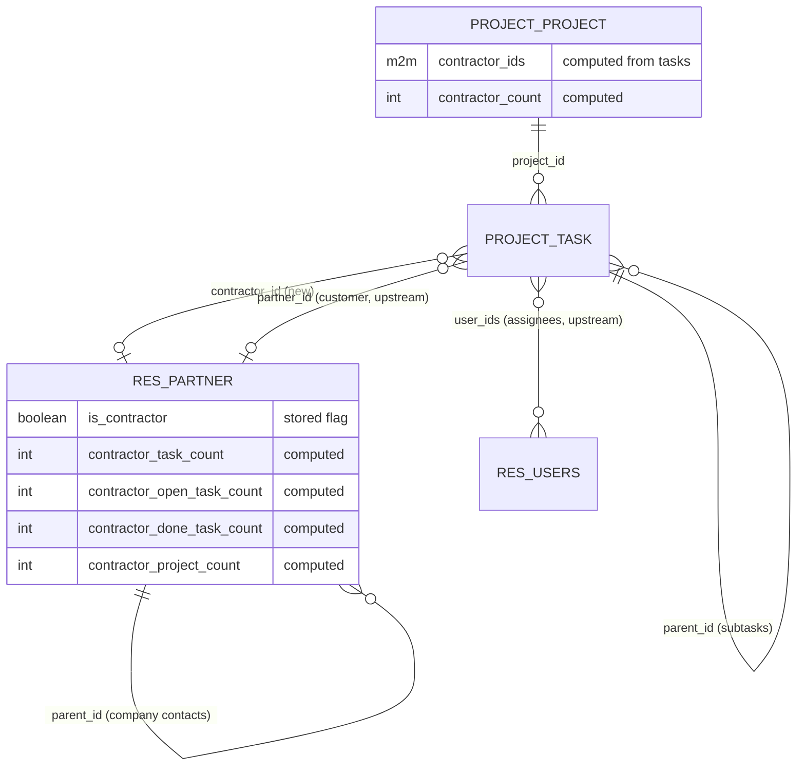
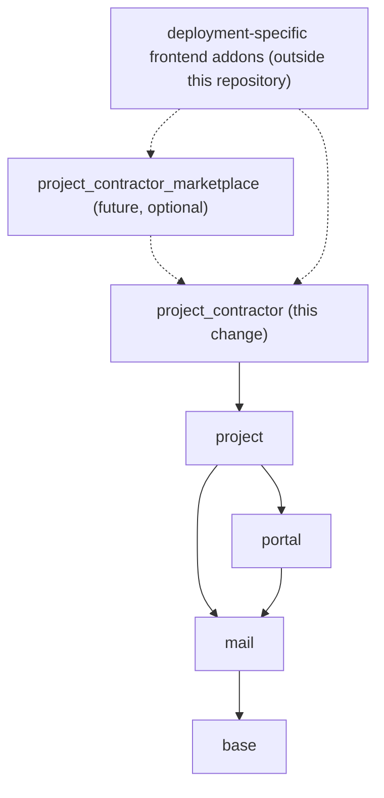

## Context

See proposal.md for motivation. Requirements live in `specs/*/spec.md`. This document explains how to meet them using only the evidence below.

### Repository state at planning time

| Path | State |
| --- | --- |
| Repository | Scaffold with no commits. Renamed by this change from `razs_contracts`; published as `odoo_project_contractor`, with the installable addon `project_contractor`. |
| Addon `__manifest__.py` | `19.0.1.0.0`, `depends: base, portal, mail`, `license: Other proprietary`, data: header-only ACL CSV |
| Addon packages | `models/` empty, `controllers/` empty, `views/` empty, `security/ir.model.access.csv` header only |
| `LICENSE` | Proprietary, "All rights reserved" |
| Install state | Not installed anywhere. |

### Verified Odoo 19 facts

| Fact | Source |
| --- | --- |
| `project` depends on `analytic`, `base_setup`, `mail`, `portal`, `rating`, `resource`, `web`, `web_tour`, `digest`. | `addons/project/__manifest__.py:11-21` |
| Core `project_*` extensions list only their direct functional dependencies, e.g. `project_hr_skills: ['project', 'hr_skills']`. `contacts` itself depends only on `base` and `mail`; the partner form and search views live in `base`. | `addons/project_*/__manifest__.py`, `addons/contacts/__manifest__.py:14` |
| `project.task.user_ids` is a Many2many to `res.users` with domain `share = False, active = True`: assignees are **internal users only**. | `project/models/project_task.py:205-206` |
| `project.task.partner_id` is labelled **Customer**, with company domain `company_id =? task company or False`. | `project_task.py:225-227` |
| Task `state` has open values `01_in_progress`, `02_changes_requested`, `03_approved` and closed values `CLOSED_STATES = {'1_done', '1_canceled'}`. `is_closed` is computed and searchable from state. | `project_task.py:84-87,168-176,402-411` |
| Subtasks use `parent_id`/`child_ids`. Task templates use `is_template`, and `child_ids` excludes templates. | `project_task.py:248-251,326-329` |
| `project.project.task_ids` has domain `is_closed = False`, so it **cannot** be used to derive history that includes closed tasks. | `project/models/project_project.py:113-114` |
| Project already adds `task_ids`/`task_count` for **customers** on `res.partner`. `_compute_task_count` rolls counts up to parents via `child_of` and `_read_group`, without `sudo`, so record rules apply. The smart button is restricted to `project.group_project_user`. | `project/models/res_partner.py`, `project/views/res_partner_views.xml:9-12` |
| Portal and project-sharing access to task fields is an **allowlist**: `PROJECT_TASK_READABLE_FIELDS` / `PROJECT_TASK_WRITABLE_FIELDS`. Fields not listed are unreadable to portal users. | `project_task.py:21-81,358` |
| `project.collaborator` shares projects with **partners** (portal users) and has `limited_access`. | `project/models/project_collaborator.py:7-16` |
| `res.partner._commercial_fields` / `_synced_commercial_fields` force fields to be managed by, or synchronized from, the commercial entity. | `base/models/res_partner.py:686-700` |
| `mrp_subcontracting` adds `is_subcontractor` on `res.partner`, a manufacturing concept unrelated to project work. There is no `is_contractor`, `contractor_id` or `project_contractor` anywhere in core. | `mrp_subcontracting/models/res_partner.py:14`, core grep |
| Many2one `convert_to_read` returns the target's display name as superuser. Any readable contractor field reveals the contractor's name to whoever can read the task. | `orm/fields_relational.py:366-376` |

## Goals / Non-Goals

**Goals:**
- Make contractor work representable with the fewest possible additions to `res.partner`, `project.task` and `project.project`.
- Keep one source of truth, task assignments, from which project participation and contractor history are derived.
- Stay inside Odoo's existing security model.
- Stay a publishable, deployment-agnostic OSS addon.

**Non-Goals:**
- Contractor portal access, timesheets, costs, purchase orders, invoicing, or vendor bills for contractors.
- Contractor skills, rates, availability, public profiles, ratings, or reviews.
- Jobs, proposals, bidding, acceptance workflows, or public or portal marketplace pages. These belong to `project_contractor_marketplace`.
- Legal contracts, subscriptions, or HR employment contracts.
- Automatic contractor assignment, followers, or notifications.

## Terminology

| Term | Meaning |
| --- | --- |
| Contractor (classification) | A contact whose contractor flag is set. |
| Eligible contractor | An active contact that is a contractor itself or belongs to a contractor commercial entity. |
| Task contractor | The single external contact performing a task. |
| Assignees | The standard internal users of a task (`user_ids`). Unchanged by this addon. |
| Customer | The standard task or project customer (`partner_id`). Unchanged by this addon. |
| Participating contractor | A contractor of at least one non-archived, non-template task of a project. |

## Decisions

### D1. No new models: extend `res.partner`, `project.task`, `project.project`

The previously planned custom models are re-evaluated:

| Planned model | Foundation? | Outcome |
| --- | --- | --- |
| contractor profile | No | Contractor identity is the partner itself, with a flag (D2). A public profile is a marketplace concern and moves to `project_contractor_marketplace`. |
| contract job | No | Project work is represented by standard `project.task`. A marketplace listing moves to the marketplace addon. |
| proposal | No | Marketplace. |
| review | No | Marketplace. |
| skill catalog | No | Marketplace (generic tags). |
| Odoo-version catalog | No | Domain-specific. Dropped from both OSS addons; a deployment can model it downstream. |

With no new models there is no need for new ACLs, record rules, sequences, or the marketplace's protected-field guard, operation layer and row locking. The foundation adds no public or portal surface and no custom lifecycle; standard task access is the boundary.

### D2. Contractor classification: explicit `is_contractor` Boolean, eligibility via the commercial entity

- `res.partner.is_contractor = fields.Boolean(string="Contractor", index=True, default=False, copy=False)`, with no tracking and no `groups`.
- Eligibility is not stored. It is the domain `[('active', '=', True), '|', ('is_contractor', '=', True), ('commercial_partner_id.is_contractor', '=', True)]`, reused by the task field domain, the constraint (D3), and the Contacts search filter "Contractors" (added to `base.view_res_partner_filter`).
- The checkbox goes on `base.view_partner_form`. The xpath anchor is chosen during implementation next to the standard classification fields (for example `category_id`), with no view replacement.

| Alternative | Why rejected |
| --- | --- |
| Separate profile model | Duplicates identity. It only pays off with marketplace data (public profile, reputation), which is out of scope. |
| Commercial field (`_commercial_fields` / `_synced_commercial_fields`) | Forces every contact of a company to share the value and hides it on individuals. That would forbid an individually flagged freelancer who belongs to a non-contractor company. |
| Partner category tag | Untyped, renamable and translatable. It can't back a reliable domain or constraint. |
| Integer rank (like `supplier_rank`) | Ranks are auto-incremented by business documents. Here the classification is a deliberate user choice, and no document drives it. |

Terminology note: this is distinct from manufacturing's `is_subcontractor`. The label is "Contractor"; the help text says "external party performing project work".

### D3. Task contractor: one Many2one `contractor_id`

- `project.task.contractor_id = fields.Many2one('res.partner', string="Contractor", index='btree_not_null', tracking=True, copy=False, domain=<eligibility> + company domain as on partner_id)`.
- `@api.constrains('contractor_id', 'company_id')` validates eligibility and company compatibility **only when those task fields change**, so later unmarking a partner never invalidates saved tasks (spec: *Existing assignment survives unmarking*).
- `copy=False` covers duplication. Task-template and recurrence creation are verified by tests: if upstream copies through `copy_data` with explicit values, the addon clears `contractor_id` in the corresponding creation path.
- There is no onchange coupling to `user_ids` or `partner_id`, and no `message_subscribe`. `tracking=True` posts an internal tracking entry only.
- Search view (`project.view_task_search_form`): a `contractor_id` field, a "Contracted Work" filter (`contractor_id != False`) and group-by Contractor. Form: the field next to assignees. List and kanban: optional column or avatar.

| Alternative | Why rejected |
| --- | --- |
| Many2many contractors | Blurs accountability. Grouping, kanban swimlanes and per-contractor reporting become ambiguous. Subtasks already model split work natively. |
| Reusing `user_ids` | It requires internal users (domain `share = False`), which contradicts the goal. |
| Reusing `partner_id` | That is the customer. |
| Boolean "contracted work" marker | Redundant with `contractor_id` and can disagree with it. |
| Contractor role or status field on the task | The task's own stage and state already describe the work's progress. A second status would drift. |

### D4. Project participation: computed only

- `project.project.contractor_ids = fields.Many2many('res.partner', compute=..., search=...)`, non-stored. The compute uses `project.task._read_group([('project_id', 'in', ids), ('contractor_id', '!=', False), ('is_template', '=', False)], ['project_id', 'contractor_id'])` under the current user (no `sudo`), with default `active_test`. It does **not** use `project.task_ids`, whose domain hides closed tasks.
- `contractor_count` is computed alongside.
- `_search_contractor_ids` returns `[('id', 'in', <task subquery on project_id>)]`.
- The smart button on `project.edit_project` (group `project.group_project_user`) opens the project's tasks with `contractor_id != False`, grouped by contractor.

*Rejected:* a stored Many2many (a second source of truth to keep in sync), a "primary contractor" field (not generically meaningful, and it duplicates task data), and "eligible contractors" per project (an access or allowlist policy with no generic consumer in the foundation; it can be added later by an extension).

### D5. Contractor work history on the partner: computed, rule-respecting, with company roll-up

- `contractor_task_ids = fields.One2many('project.task', 'contractor_id')`: direct assignments, `groups='project.group_project_user'`.
- `contractor_task_count`, `contractor_open_task_count` (`is_closed = False`), `contractor_done_task_count` (`state = '1_done'`) and `contractor_project_count`: non-stored integers with `groups='project.group_project_user'`.
- The computation mirrors upstream `_compute_task_count`:
  1. `search_fetch([('id', 'child_of', ids)], ['parent_id'])` with `active_test=False`;
  2. `_read_group` on tasks by `contractor_id` and `state` (plus a distinct project read), excluding templates;
  3. roll counts up through `parent_id`.

  No `sudo`, so record rules and allowed companies apply (specs: *History respects the viewer's access*, *Multi-company consistency*).
- The actions `action_view_contractor_tasks` / `action_view_contractor_projects` open tasks with domain `contractor_id child_of partner` and context filters "open", "done" or all, or the distinct projects. Smart buttons go in `base.view_partner_form`'s `button_box`, restricted to `project.group_project_user`.
- *Rejected:* stored counters (manual drift, recompute cost on every task write across partner hierarchies) and a history log model (duplicates tracking and tasks).

### D6. Access control: no new security objects

- There are no new models, so there are no CSV lines, groups or rules. Task contractor access equals task access; classification access equals partner access.
- History fields and buttons are limited to `project.group_project_user`, as upstream does for customer task counts.
- **Portal and project sharing:** the addon does **not** add `contractor_id` or any history field to `PROJECT_TASK_READABLE_FIELDS` / `PROJECT_TASK_WRITABLE_FIELDS`, so portal collaborators can't read them. Exposing contractors to portal users is an extension point that needs an explicit privacy decision.
- The Many2one display-name fact means anyone who can read a task learns its contractor's name. Internal task readers are the intended audience; portal users are excluded by the allowlist.

### D7. Dependencies: `project` only

- `base` is always loaded first, and `res.partner` is a base model. Tracking on `project.task.contractor_id` uses the task's `mail.thread` inheritance, which `project` provides. `is_contractor` has no tracking, so the addon uses no `mail` feature on its own. Declaring only `project` matches the core `project_*` convention.
- `contacts` is **not** needed: every partner view extended is in `base`.
- Nothing in this repository depends on, or is referenced by, any frontend addon. Frontend addons depend on this one, never the reverse.

### D8. Distribution and naming

- **Technical name** `project_contractor`, following the upstream `project_<feature>` pattern. Collision checks found nothing in Odoo 19 core or the maintainer's other addons, and a web search found nothing on the Odoo Apps Store or in OCA/project (a search can't prove absence).
- **Manifest:**
  - `name` "Project Contractors", `category` `Services/Project`, `version` `19.0.1.0.0`;
  - `license` = the approved license;
  - `application: False`;
  - no `pre_init_hook` or `post_init_hook`, and no controllers, website templates or assets.
- **Repository layout:** the repository (published as `odoo_project_contractor`) holds the addon folder `project_contractor/`, with README, LICENSE and `.gitignore` at the repository root. The optional marketplace addon's location (a sibling addon folder in this repo, OCA-style, or its own wrapper repo) is decided before that change is implemented. Its plan temporarily lives in this repo's `openspec/changes/`.
- **Rename:** the scaffold was never installed, so renaming it from `razs_contracts` needs no data migration.

### D9. License: LGPL-3 (approved)

- **Findings at planning time:**
  - the scaffold's `LICENSE` and manifest carried a placeholder proprietary license;
  - the maintainer's existing open-source Odoo addon uses **LGPL-3**;
  - Odoo 19 Community itself is LGPL-3.
- **Options considered:**
  - **LGPL-3**: consistent with Odoo Community, and permissive enough for proprietary downstream addons to depend on it.
  - **AGPL-3** (the OCA default): guarantees that network-deployed modifications are shared, but discourages some integrators.
- **Decision:** the maintainer approved **LGPL-3** (task 1.1). The `LICENSE` file (LGPL-3 text followed by the GPL-3 text it incorporates) and the manifest were changed together (spec: *Consistent open-source license*).

## Risks / Trade-offs

- **[Risk] Upstream view anchors change in a 19.0 point release.** → Anchor xpaths on stable field names (`user_ids`, `category_id`, `button_box`), and cover every inherited view with an install and upgrade test.
- **[Risk] Company-contractor semantics surprise users**, since the contacts of a flagged company become eligible. → The field help text and README explain it; the individual flag is unaffected.
- **[Risk] Per-viewer counts differ between users.** → Intended (rules respected), and documented.
- **[Risk] Task-template or recurrence creation copies `contractor_id` despite `copy=False`.** → Explicit tests; clear the value in the upstream creation path if needed.
- **[Trade-off] Single contractor per task.** Multi-contractor work requires subtasks. This is simpler reporting at the cost of one more task.
- **[Trade-off] Contractors can't see their tasks in the portal.** This is a deliberate privacy default and a future opt-in extension.

## Migration Plan

1. **Planning-time rename:** repository and addon folder renamed from `razs_contracts` to `project_contractor`, with neutral README and manifest identity metadata. No database or server change.
2. **Implementation:**
   - development and tests run in a disposable test database (`project-contractor-test-odoo`), created only after the maintainer confirms;
   - `odoo-bin -c <config> -d project-contractor-test-odoo -i project_contractor --test-tags /project_contractor --stop-after-init --http-port <free port>`.
3. **Rollback:** the addon holds only additive columns, so uninstalling removes them (spec: *Clean uninstallation*). Uninstalling where data exists is destructive to contractor data and needs explicit confirmation.

## Test Strategy

`project_contractor/tests/`, using `TransactionCase` (and `HttpCase` for the portal RPC check), tagged `post_install`, `-at_install`:
- `common.py`: two companies; contacts (a person, a contractor company with a child contact, a non-contractor company with children, an archived contractor, a contact with a portal user); a project user, a read-only project user, an internal user without Project, a portal collaborator; projects with open, done, cancelled, archived and template tasks.
- One test module per capability, with one test per spec scenario:
  - `test_contact_classification.py`
  - `test_task_assignment.py`
  - `test_project_participation.py`
  - `test_work_history.py`
  - `test_access_control.py`
  - `test_distribution.py`: manifest `depends == ['project']`, no hooks, no addon-owned groups, rules or ACLs, labels, uninstall.

## Implementation Notes

Refinements made while implementing, all within the specs:
- **Per-viewer computes.** The partner work-history and project participation computes declare `@api.depends_context('uid', 'allowed_company_ids')`. Without it, Odoo's field cache could reuse one viewer's counts for another user or company context within the same transaction.
- **Work domain.** A shared `project.task._get_contractor_work_domain()` excludes archived tasks explicitly, plus task templates and project-template tasks via upstream's `has_template_ancestor` / `has_project_template` (not only `is_template`).
- **Two constraints.** Eligibility is validated only when `contractor_id` changes, and company compatibility when `contractor_id` or `company_id` changes. Moving a task whose past contractor was later unmarked therefore still works.
- **Project fields restricted.** `project.project.contractor_ids` / `contractor_count` are also restricted to `project.group_project_user`, so portal users cannot read participation.
- **Labels.** *Contractor Work*, *Contractor Done* and *Contractor Projects* stat buttons, a *With Contractor* filter and a *Contractor* group-by, so every added label names contractors and none reads as "contract".
- **`copy=False` is sufficient.** Upstream duplication, template creation and recurrence all respect it; no extra clearing code was needed.
- **UI smoke tests.** `tests/test_ui.py` (headless browser, `HttpCase.browser_js`) renders the partner form, task form, task kanban card and project form. It needs the `websocket-client` Python package in the test environment and is skipped otherwise.

## Open Questions

_None._ The license question is resolved: LGPL-3 (D9).
